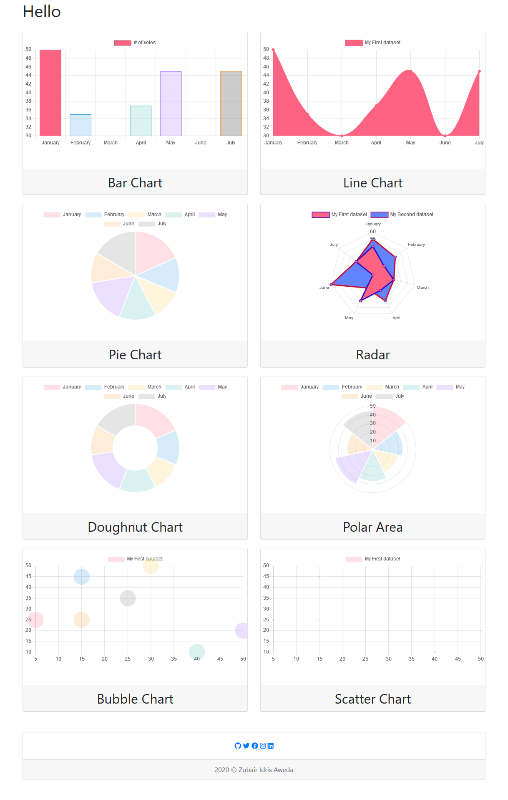

# ChartJS - Data Visualisations 📈📉📊

The charts in the page where made with chart.js, a JavaScript library for data visualizations, and are written in PHP files so they may be copied and re-used independently. These are ready-to-go code snippets you can use in your applications to make very amazing visuals.

## Technologies Used 
*  HTML
*  CSS
*  JavaScript
*  PHP

## Medium Link
An article explaining how to make these charts is in the works already.

## Live Link
**[CHART JS](https://mychartjs.herokuapp.com/)**

